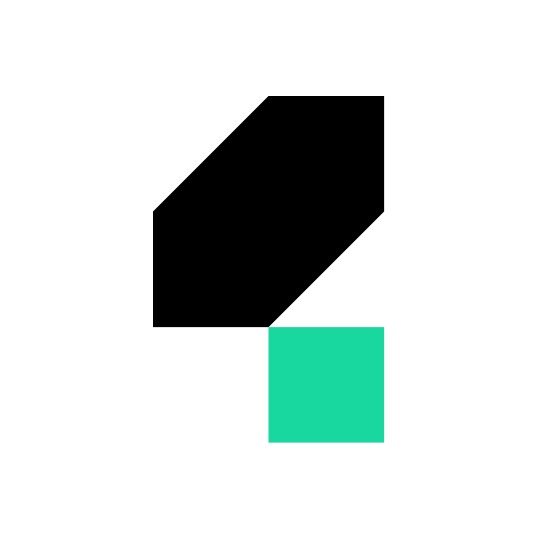

# Hi, I'm Asem Shaltout 👋

### Software Engineer

`Full-Stack Development` • `AI & Machine Learning` • `Software Testing`

&nbsp;&nbsp;

---

## 👨‍💻 About Me

Software Engineering graduate with a **B.Sc. in Computer Science — Software Engineering** and dual degrees from **MSA University** and the **University of Greenwich**. I build full-stack applications, develop AI-powered solutions, and create reliable automated test suites. I enjoy taking ideas from requirements and system design through implementation, validation, and deployment.

- 💼 Completed a rotational Software Engineering internship at **eVision | Digital Financial Systems (Fintech)**
- 👨‍🏫 Former coding instructor who taught **200+ students** programming and AI fundamentals

## 🚀 Project Highlights

### 🧠 PreDoc — Brain Stroke Prediction

Dual-modality ML system that analyzes clinical records and MRI scans using **Random Forest** and **ResNet-50**. Achieved **96.35%** and **97.45%** accuracy, with the research published in **IEEE Xplore**.

### 🍽️ Leila — Restaurant Operations Platform

Real-time full-stack platform with role-based workspaces for restaurant teams, covering orders, payments, shifts, inventory, expenses, notifications, reporting, and production monitoring.

## 💻 Languages

  
  
  
  
  
  

## ⚙️ Frameworks & Libraries

  
  
  
  
  

## 🗄️ Databases

  
  
  
  

## 🧪 Testing

  
  
  
  
  

## 🔧 Tools & Platforms

  
  
  
  
  

---

  Building thoughtful software, one problem at a time.

